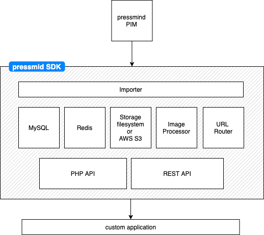

# pressmind® SDK

This library is meant to be used as a composer requirement and is not intended to be used *as-is*. If you are looking 
for a *out-of-the-box* working implementation, please have a look at the 

[pressmind web-core](https://github.com/pressmind/web-core-skeleton-basic) for a working implementation in vanilla PHP (documentation is placed here!)

or 
  
[WordPress Travelshop Theme](https://github.com/pressmind/wp-travelshop-theme) for a complete WordPress theme.

## System overview

The pressmind SDK is a caching layer for none-bookable (and extendable for bookable) content between pressmind PIM and your application with a nice comfortable PHP and REST API.

