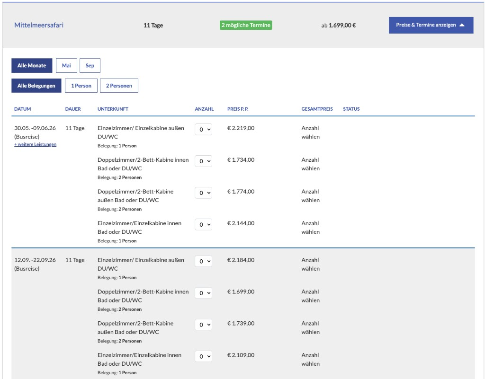

# Booking Offer Table

[← Back to Documentation](documentation.md) | [→ CheapestPrice Aggregation](cheapest-price-aggregation.md)

---

## Table of Contents

- [Overview](#overview)
- [Rendering the Offer Table (CheapestPriceSpeed)](#rendering-the-offer-table-cheapestpricespeed)
  - [Filter Setup](#filter-setup)
  - [The Render Loop](#the-render-loop)
  - [CheapestPriceSpeed Properties Reference](#cheapestpricespeed-properties-reference)
  - [Price Display with Early Bird Discounts](#price-display-with-early-bird-discounts)
  - [Grouping by Month](#grouping-by-month)
- [Building Booking Links (IBE Deep Links)](#building-booking-links-ibe-deep-links)
  - [Required Parameters](#required-parameters)
  - [Optional Parameters](#optional-parameters)
  - [Example: Building a Booking Link](#example-building-a-booking-link)
- [Availability Check (IBE API)](#availability-check-ibe-api)
- [Rendering the Cheapest Price (Listing / Teaser)](#rendering-the-cheapest-price-listing--teaser)
- [Starting Points and Price Contribution](#starting-points-and-price-contribution)
- [State Handling](#state-handling)
- [ORM-Based Loop (Advanced)](#orm-based-loop-advanced)
- [Key Classes Reference](#key-classes-reference)

---

## Overview

The booking offer table ("Termine & Preise") is the primary frontend component on travel product detail pages. It displays available departure dates, durations, accommodations, occupancies, and prices — allowing the customer to select and book a specific offer.

There are two ways to access touristic data in the SDK:

```
Recommended:  MediaObject → getCheapestPrices() → CheapestPriceSpeed[]
              Each row is a final, fully resolved offer price.

Advanced:     MediaObject → booking_packages → dates → getHousingOptions()
              Raw touristic data. Prices are NOT final offer prices.
```

**Always use `CheapestPriceSpeed` for price display.** The `price_total` field in `CheapestPriceSpeed` is the only value that represents a complete, bookable offer price. It includes all mandatory components:

- Base option price (housing, ticket, extra, sightseeing, or transport — depending on `price_mix`)
- Required secondary options (mandatory extras, tickets, sightseeings)
- Transport costs (outbound + return)
- Starting point surcharges
- Early bird discounts (if applicable)

See [CheapestPrice Aggregation](cheapest-price-aggregation.md) for the full calculation pipeline.

### Example Output

The following screenshot shows a typical booking offer table as rendered on a detail page. The toggle bar displays the product name, duration, available dates count, and the cheapest price. When expanded, offers are grouped by departure date with columns for date, duration, accommodation (with occupancy), quantity selector, price per person, total price, and booking status.



Key elements visible in this example:

- **Toggle bar:** "Mittelmeersafari | 11 Tage | 2 mogliche Termine | ab 1.699,00 EUR"
- **Filter buttons:** month filter ("Alle Monate", "Mai", "Sep") and occupancy filter ("Alle Belegungen", "1 Person", "2 Personen")
- **Offer rows grouped by date:** each departure date shows all available housing options (e.g. "Einzelzimmer/Einzelkabine", "Doppelzimmer/2-Bett-Kabine") with their occupancy and per-person price
- **Quantity selector:** dropdown per housing option to select the number of rooms/cabins
- **Price column:** final per-person price (`price_total` from `CheapestPriceSpeed`)

---

## Rendering the Offer Table (CheapestPriceSpeed)

### Filter Setup

Use `Pressmind\Search\CheapestPrice` to configure which offers to load:

```php
use Pressmind\Search\CheapestPrice;

$filter = new CheapestPrice();
$filter->occupancies = [2];
$filter->occupancies_disable_fallback = true;
```

Common filter properties:

| Property | Type | Description |
|---|---|---|
| `occupancies` | int[] | Room occupancy filter (e.g. `[2]` for double rooms) |
| `occupancies_disable_fallback` | bool | If `true`, do not fall back to other occupancies when none match |
| `duration_from` / `duration_to` | int | Duration range in days |
| `date_from` / `date_to` | DateTime | Departure date range |
| `price_from` / `price_to` | float | Price range |
| `transport_types` | string[] | Transport type filter (e.g. `['FLUG']`) |
| `transport_1_airport` | string[] | Departure airport IATA codes |
| `id_booking_package` | string | Restrict to a specific booking package |
| `id_housing_package` | string | Restrict to a specific housing package |
| `agency` | string | Agency ID for agency-specific pricing |
| `state` | int | Preferred state (`3` = bookable, `1` = request) |
| `state_fallback_order` | int[] | Fallback order, default: `[3, 1, 5]` |

### The Render Loop

Load offers and render them as a table:

```php
use Pressmind\Search\CheapestPrice;

/** @var \Pressmind\ORM\Object\MediaObject $mediaObject */

$filter = new CheapestPrice();
$filter->occupancies_disable_fallback = true;

/** @var \Pressmind\ORM\Object\CheapestPriceSpeed[] $offers */
$offers = $mediaObject->getCheapestPrices(
    $filter,
    ['date_departure' => 'ASC', 'price_total' => 'ASC'],
    [0, 100]
);

// Group by date for rendering
$groupedOffers = [];
foreach ($offers as $offer) {
    $groupedOffers[$offer->id_date][] = $offer;
}

foreach ($groupedOffers as $dateOffers) {
    foreach ($dateOffers as $offer) {
        // Each $offer is a CheapestPriceSpeed object with final prices
        $departure  = $offer->date_departure->format('d.m.Y');
        $arrival    = $offer->date_arrival->format('d.m.Y');
        $duration   = $offer->duration;
        $roomName   = implode(', ', array_filter([
            $offer->housing_package_name,
            $offer->option_name
        ]));
        $boardType  = $offer->option_board_type;
        $occupancy  = $offer->option_occupancy;
        $priceTotal = number_format($offer->price_total, 2, ',', '.') . ' €';
        $state      = $offer->state; // 3=bookable, 1=request, 5=stop
    }
}
```

### CheapestPriceSpeed Properties Reference

For the complete property reference of all fields available on `CheapestPriceSpeed`, see **[CheapestPriceSpeed Property Reference](cheapest-price-speed-reference.md)**.

The most important properties for rendering the offer table are: `date_departure`, `date_arrival`, `duration`, `housing_package_name`, `option_name`, `option_board_type`, `option_occupancy`, `price_total`, `price_regular_before_discount`, `state`, `transport_type`, and the early bird fields (`earlybird_discount`, `earlybird_name`, `earlybird_discount_date_to`).

### Price Display with Early Bird Discounts

When an early bird discount is active, `price_regular_before_discount` contains the original price and `price_total` contains the discounted price:

```php
/** @var \Pressmind\ORM\Object\CheapestPriceSpeed $offer */

$hasDiscount = !empty($offer->earlybird_discount) || !empty($offer->earlybird_discount_f);

if ($hasDiscount && $offer->price_regular_before_discount > 0) {
    $originalPrice = number_format($offer->price_regular_before_discount, 2, ',', '.') . ' €';
    $finalPrice    = number_format($offer->price_total, 2, ',', '.') . ' €';
    $discountName  = $offer->earlybird_name;
    $validUntil    = $offer->earlybird_discount_date_to
        ? $offer->earlybird_discount_date_to->format('d.m.Y')
        : null;

    // Render: crossed-out original price + discounted price + label
    // e.g. "<del>1.297,00 €</del> ab 1.205,10 € (Frühbucher bis 31.03.)"
} else {
    $finalPrice = number_format($offer->price_total, 2, ',', '.') . ' €';
    // Render: "ab 1.297,00 €"
}
```

### Grouping by Month

A common pattern is to group offers by month with section headers:

```php
$currentMonth = null;

foreach ($groupedOffers as $dateOffers) {
    $offer = $dateOffers[0];
    $month = $offer->date_departure->format('Y-m');

    if ($currentMonth !== $month) {
        $currentMonth = $month;
        $monthName = strftime('%B %Y', $offer->date_departure->getTimestamp());
        // Render month header, e.g. "<h3>Juni 2026</h3>"
    }

    foreach ($dateOffers as $offer) {
        // Render offer row
    }
}
```

---

## Building Booking Links (IBE Deep Links)

Each `CheapestPriceSpeed` row contains all IDs needed to build a deep link to the IBE (Internet Booking Engine). The link pre-selects the exact offer for the customer.

### Required Parameters

| Parameter | Source Property | Description |
|---|---|---|
| `imo` | `id_media_object` | MediaObject / product ID |
| `idbp` | `id_booking_package` | Booking package ID |
| `idd` | `id_date` | Date / departure ID |
| `iho[{id_option}]` | `id_option` | Housing option with quantity (value = room count) |

### Optional Parameters

| Parameter | Source Property | Description |
|---|---|---|
| `idt1` | `id_transport_1` | Outbound transport ID |
| `idt2` | `id_transport_2` | Return transport ID |
| `tt` | `transport_type` | Transport type (e.g. `FLUG`) |
| `t` | — | Booking type: `request` (on-request) or `fix` (direct booking) |
| `dc` | — | Discount code |
| `hodh` | — | Set to `1` to show the housing option dialog |
| `url` | — | Base64-encoded return URL for "back" navigation |

### Example: Building a Booking Link

```php
/**
 * Build a booking deep link from a CheapestPriceSpeed offer.
 *
 * @param \Pressmind\ORM\Object\CheapestPriceSpeed $offer
 * @param string $ibeBaseUrl  IBE base URL (e.g. "https://buchung.weltenbummler.com")
 * @param string|null $returnUrl  URL the customer returns to after booking
 * @param string|null $bookingType  "request" for availability check, "fix" for direct booking
 * @return string
 */
function buildBookingLink($offer, $ibeBaseUrl, $returnUrl = null, $bookingType = null)
{
    $params = [];
    $params[] = 'imo=' . $offer->id_media_object;
    $params[] = 'idbp=' . $offer->id_booking_package;
    $params[] = 'idd=' . $offer->id_date;

    if (!empty($offer->id_option)) {
        $params[] = 'iho[' . $offer->id_option . ']=1';
    }

    if (!empty($offer->transport_type)) {
        $params[] = 'idt1=' . $offer->id_transport_1;
        $params[] = 'idt2=' . $offer->id_transport_2;
        $params[] = 'tt=' . $offer->transport_type;
    }

    if ($bookingType !== null) {
        $params[] = 't=' . $bookingType;
    }

    if ($returnUrl !== null) {
        $params[] = 'url=' . base64_encode($returnUrl);
    }

    return rtrim($ibeBaseUrl, '/') . '/?' . implode('&', $params);
}
```

**Usage:**

```php
// Direct booking link
$bookingUrl = buildBookingLink($offer, 'https://buchung.weltenbummler.com', $currentPageUrl);

// Request / availability check link
$requestUrl = buildBookingLink($offer, 'https://buchung.weltenbummler.com', $currentPageUrl, 'request');
```

**Output example:**

```
https://buchung.weltenbummler.com/?imo=12345&idbp=abc123&idd=def456&iho[ghi789]=1&idt1=t1id&idt2=t2id&tt=FLUG
```

---

## Availability Check (IBE API)

Before or after rendering the offer table, you can verify real-time availability through the IBE3 REST API. This checks the actual CRS (Central Reservation System) for current availability.

**Endpoint:** `POST {IBE3_BASE_URL}/api/external/checkAvailability`

```php
/**
 * Check real-time availability for a specific offer.
 *
 * @param string $ibeBaseUrl  IBE base URL (e.g. "https://buchung.weltenbummler.com")
 * @param string $dateCodeIbe  The date's IBE code (CheapestPriceSpeed::date_code_ibe)
 * @param string[] $optionCodesIbe  Array of option IBE codes (e.g. [option_code_ibe])
 * @return array|false  CRS response or false on error
 */
function checkAvailability($ibeBaseUrl, $dateCodeIbe, $optionCodesIbe)
{
    $url = rtrim($ibeBaseUrl, '/') . '/api/external/checkAvailability';

    $payload = json_encode([
        'id' => $dateCodeIbe,
        'options' => $optionCodesIbe,
    ]);

    $ch = curl_init($url);
    curl_setopt($ch, CURLOPT_CUSTOMREQUEST, 'POST');
    curl_setopt($ch, CURLOPT_POSTFIELDS, $payload);
    curl_setopt($ch, CURLOPT_RETURNTRANSFER, true);
    curl_setopt($ch, CURLOPT_HTTPHEADER, [
        'Content-Type: application/json',
        'Content-Length: ' . strlen($payload),
    ]);
    $result = curl_exec($ch);
    curl_close($ch);

    $decoded = json_decode($result, true);
    return json_last_error() === JSON_ERROR_NONE ? $decoded : false;
}
```

**Usage with CheapestPriceSpeed:**

```php
$availability = checkAvailability(
    'https://buchung.weltenbummler.com',
    $offer->date_code_ibe,
    [$offer->option_code_ibe]
);
```

The response is a direct pass-through from the connected CRS. The structure varies by CRS provider, but typically indicates whether the combination is bookable, on request, or sold out.

---

## Rendering the Cheapest Price (Listing / Teaser)

For listing pages, search results, or the summary bar above the offer table, use `getCheapestPrice()` (singular) to get the single best price:

```php
use Pressmind\Search\CheapestPrice;

$filter = new CheapestPrice();
$filter->occupancies = [2];

/** @var \Pressmind\ORM\Object\CheapestPriceSpeed|null $cheapestPrice */
$cheapestPrice = $mediaObject->getCheapestPrice($filter);

if ($cheapestPrice !== null) {
    $duration  = $cheapestPrice->duration;
    $price     = number_format($cheapestPrice->price_total, 2, ',', '.') . ' €';
    $dateCount = count($mediaObject->getCheapestPrices($filter));

    // Render: "Musical-Erlebnis Hamburg | 3 Tage | 7 Termine | ab 259,00 €"
}
```

The method applies a **state-priority sort**: bookable offers (state 3) are preferred over request offers (state 1), which are preferred over stop offers (state 5). Within the same state, the lowest `price_total` wins. See [Price Selection Logic](price-selection-logic.md) for details.

---

## Starting Points and Price Contribution

Starting points are boarding locations for bus trips or similar ground transport. Each starting point option can carry a surcharge that directly affects `price_total` in `CheapestPriceSpeed`. Understanding how starting points influence the final price is important for correct price display.

### How Starting Points Affect price_total

The starting point surcharge is part of the price formula:

```
price_total = option.price + transport_way1.price + transport_way2.price
            + starting_point.price + included_options_price
            - earlybird_discount
```

The starting point price calculation depends on the `price_per_day` flag on the `Startingpoint\Option`:

| `price_per_day` | Calculation | Example |
|---|---|---|
| `false` (default) | `starting_point.price` (flat surcharge) | 15,00 EUR one-time |
| `true` | `starting_point.price × duration` | 5,00 EUR × 8 days = 40,00 EUR |

If `use_earlybird` is `true` on the starting point option, the surcharge is also included in the early bird discount base, meaning discounts apply to the starting point fee as well.

### Configuration: One Row vs. Per-City Rows

By default, only the **cheapest** starting point option is used for each `CheapestPriceSpeed` entry. This means all offers show the lowest possible starting point surcharge.

When `generate_offer_for_each_startingpoint_option` is enabled, the aggregation creates a **separate row per starting point city**. This allows:

- Displaying different prices per departure city
- Filtering offers by starting point city or ZIP code
- Showing city-specific prices in the MongoDB search index

```json
{
  "data": {
    "touristic": {
      "generate_offer_for_each_startingpoint_option": true
    }
  }
}
```

**Impact on data volume:** Enabling this multiplies the number of `CheapestPriceSpeed` rows by the number of starting point cities. A product with 50 dates, 5 options, and 20 starting points produces 5,000 rows instead of 250.

See [Configuration: Touristic Data](config-touristic-data.md#datatouristicgenerate_offer_for_each_startingpoint_option) for details.

### Rendering Starting Point Information

When starting points are present, the relevant fields on `CheapestPriceSpeed` are populated:

```php
/** @var \Pressmind\ORM\Object\CheapestPriceSpeed $offer */

if (!empty($offer->startingpoint_name)) {
    $startingPoint = $offer->startingpoint_name;
    $city          = $offer->startingpoint_city;
    $zip           = $offer->startingpoint_zip;

    // Render: "Abfahrt: ZOB Hamburg (20097)"
}
```

For the complete starting point property reference, see [CheapestPriceSpeed Reference — Starting Point](cheapest-price-speed-reference.md#starting-point).

---

## State Handling

Each `CheapestPriceSpeed` row has a `state` field that represents the combined availability of all components (date + option + transport):

| State | Name | Meaning | Recommended Display |
|---|---|---|---|
| `3` | Bookable | All components are available for direct booking | Green "Buchbar" / "zur Buchung" button |
| `1` | Request | At least one component requires availability confirmation | Yellow "Auf Anfrage" button |
| `5` | Stop | At least one component blocks booking | Grey "Nicht verfügbar" or hide the row |

**State constants** are defined in `Pressmind\Search\CheapestPrice`:

```php
CheapestPrice::STATE_BOOKABLE = 3;
CheapestPrice::STATE_REQUEST  = 1;
CheapestPrice::STATE_STOP     = 5;
```

For the full state determination logic (how component states combine), see [CheapestPrice Aggregation — State Machine](cheapest-price-aggregation.md#state-machine).

---

## ORM-Based Loop (Advanced)

> **Warning:** The ORM-based loop through `booking_packages -> dates -> getHousingOptions()` provides access to the **raw touristic data structure**. However, `Option.price` contains only the base option price. It does **NOT** include:
>
> - Required secondary options (mandatory extras, tickets, sightseeings)
> - Transport surcharges
> - Starting point fees
> - Early bird discounts
>
> **Never display `Option.price` as a final offer price.** Always use `CheapestPriceSpeed.price_total` for any price shown to the customer.

The ORM loop is useful when you need access to data not available in `CheapestPriceSpeed`, such as:

- Custom grouping by housing package or board type
- Displaying option metadata (`description_long`, `quota`, `reservation_date_from/to`)
- Building non-standard offer structures

```php
/** @var \Pressmind\ORM\Object\MediaObject $mediaObject */

foreach ($mediaObject->booking_packages as $bookingPackage) {
    $duration = $bookingPackage->duration;
    $priceMix = $bookingPackage->price_mix;

    foreach ($bookingPackage->dates as $date) {
        $departure = $date->departure;
        $arrival   = $date->arrival;

        foreach ($date->getHousingOptions() as $housingOption) {
            $housingPackage = $housingOption->getHousingPackage();

            $roomName  = $housingPackage->name;
            $optName   = $housingOption->name;
            $boardType = $housingOption->board_type;
            $occupancy = $housingOption->occupancy;
            $basePrice = $housingOption->price; // NOT the final offer price!

            // To get the final price, query CheapestPriceSpeed:
            $priceFilter = new \Pressmind\Search\CheapestPrice();
            $priceFilter->id_option = $housingOption->id;
            $priceFilter->id_booking_package = $housingOption->id_booking_package;
            $priceFilter->id_date = $date->id;
            $finalPrice = $mediaObject->getCheapestPrice($priceFilter);

            if ($finalPrice !== null) {
                $offerPrice = $finalPrice->price_total;
            }
        }
    }
}
```

This approach generates significantly more database queries than the CheapestPriceSpeed loop. For a product with 2 booking packages, 50 dates, and 5 housing options, the ORM loop executes ~500 individual queries, while the CheapestPriceSpeed approach uses a single query.

---

## Key Classes Reference

| Class | Description | Documentation |
|---|---|---|
| `Pressmind\ORM\Object\MediaObject` | Entry point. `getCheapestPrice()` and `getCheapestPrices()` | [MediaObject](mediaobject.md) |
| `Pressmind\ORM\Object\CheapestPriceSpeed` | Denormalized, final offer price row | [CheapestPrice Aggregation](cheapest-price-aggregation.md#cheapestpricespeed-output) |
| `Pressmind\Search\CheapestPrice` | Filter DTO for price queries | [Price Selection Logic](price-selection-logic.md) |
| `Pressmind\ORM\Object\Touristic\Booking\Package` | Top-level touristic container | [Booking Package](Touristic/Booking/Package.md) |
| `Pressmind\ORM\Object\Touristic\Date` | Departure date with `getHousingOptions()` | [Date](Touristic/Date.md) |
| `Pressmind\ORM\Object\Touristic\Housing\Package` | Accommodation grouping (rooms/cabins) | [Housing Package](Touristic/Housing/Package.md) |
| `Pressmind\ORM\Object\Touristic\Option` | Priced option (raw price, NOT final) | [Option](Touristic/Option.md) |
