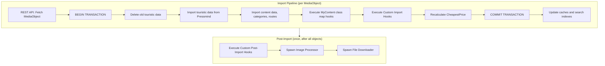
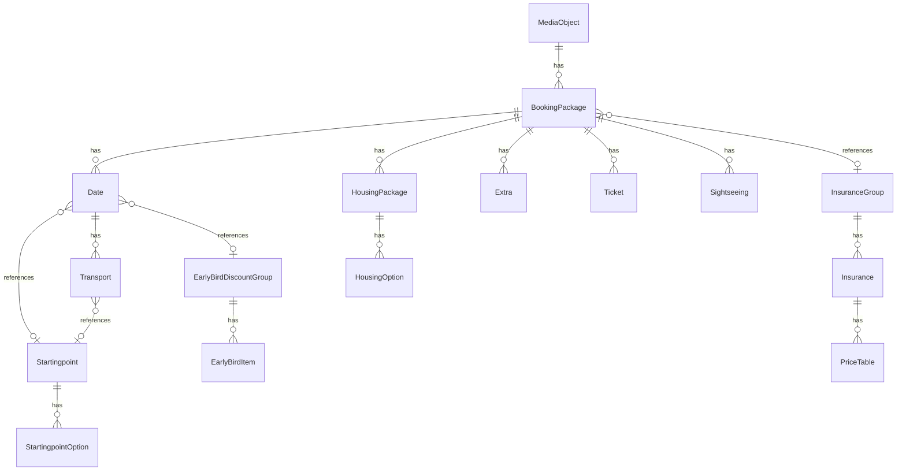

# Custom Import Hooks

[← Back to Import Process](import-process.md) | [→ Booking Package Guide](booking-package-guide.md) | [→ Configuration: Touristic Data](config-touristic-data.md)

---

## Table of Contents

- [Overview](#overview)
- [Hook Lifecycle](#hook-lifecycle)
- [Touristic Data Model](#touristic-data-model)
  - [Entity Hierarchy](#entity-hierarchy)
  - [Season Matching](#season-matching)
  - [States Reference](#states-reference)
- [Mapping Strategies](#mapping-strategies)
  - [Strategy A: Multiple Dates per Booking Package](#strategy-a-multiple-dates-per-booking-package)
  - [Strategy B: One Booking Package per Date](#strategy-b-one-booking-package-per-date)
- [Global vs. Per-Object Data Import](#global-vs-per-object-data-import)
- [Interface Contract](#interface-contract)
- [Configuration](#configuration)
- [Feed Normalizer](#feed-normalizer)
- [Feed Structure and JSON Examples](#feed-structure-and-json-examples)
  - [Response Envelope](#response-envelope)
  - [Booking Packages](#booking-packages)
  - [Starting Points](#starting-points)
  - [Insurances](#insurances)
  - [Early Bird Discounts](#early-bird-discounts)
  - [Discounts](#discounts)
- [Example Implementations](#example-implementations)
  - [Minimal Example: Data Transformation](#minimal-example-data-transformation)
  - [Full External API Integration with BasicAuth](#full-external-api-integration-with-basicauth)
  - [Post-Import Example](#post-import-example)
- [Best Practices and Pitfalls](#best-practices-and-pitfalls)

---

## Overview

Custom Import Hooks allow external data sources — reservation systems, channel managers, ERPs, or any API — to inject touristic data (booking packages, prices, insurances, departure points, discounts) into the pressmind® SDK during the import process.

> **For the external CRS integrator:** See the [Custom Import API Specification](custom-import-api-specification.md) for the standalone API contract — endpoint definitions, response formats, and complete field references that can be shared directly with the external system provider.

The pressmind® SDK provides two hook points:

| Hook Type | Config Key | Execution Context | Receives |
|---|---|---|---|
| **Per-Object Hook** | `media_type_custom_import_hooks` | Inside DB transaction, per media object | `$id_media_object` in constructor |
| **Post-Import Hook** | `media_type_custom_post_import_hooks` | After all imports, outside transaction | Array of `$id_media_object` values |

Per-Object Hooks are the primary extension point for importing external touristic data. They run for every media object during import and can fetch data from any source, transform it, and write it into the SDK's ORM layer.

Post-Import Hooks run once after all objects have been imported and are suited for aggregate operations (e.g. building virtual category trees, generating sitemaps).

---

## Hook Lifecycle

The following diagram shows where Custom Import Hooks execute within the pressmind® SDK import pipeline:



**Key points:**
- Per-Object Hooks execute **inside the database transaction**. If the hook throws an exception, the entire import for that media object is rolled back.
- The pressmind® SDK deletes old touristic data (booking packages, dates, etc.) **before** the hook runs. The hook is responsible for creating new data.
- After the hook completes, the pressmind® SDK recalculates the cheapest price index (`insertCheapestPrice()`).
- Hooks also run when only touristic data is updated (`importTouristicDataOnly`), not just during full imports.

---

## Touristic Data Model

Before implementing a hook, it is essential to understand the entity hierarchy and how entities relate to each other. The hook's primary job is to create these entities from external source data.

### Entity Hierarchy



| Entity | ORM Class | Description |
|---|---|---|
| **Booking Package** | `Touristic\Booking\Package` | Root touristic entity. Defines a bookable offer variant with a specific duration. |
| **Date** | `Touristic\Date` | A departure/arrival pair within a Booking Package. Carries a `season` code for price matching. |
| **Housing Package** | `Touristic\Housing\Package` | Groups accommodation options (room types) within a Booking Package. |
| **Housing Option** | `Touristic\Option` (type=`housing_option`) | A specific room/cabin category with price for a given season. |
| **Extra** | `Touristic\Option` (type=`extra`) | Optional add-on service (transfers, meals, equipment). |
| **Ticket** | `Touristic\Option` (type=`ticket`) | Entrance tickets, event access. |
| **Sightseeing** | `Touristic\Option` (type=`sightseeing`) | Excursions, guided tours. |
| **Transport** | `Touristic\Transport` | Transport option attached to a Date (flight, bus, train). |
| **Startingpoint** | `Touristic\Startingpoint` | Departure location group with options and zip ranges. |
| **Insurance Group** | `Touristic\Insurance\Group` | Insurance offering referenced from Booking Package. |
| **Early Bird Discount** | `Touristic\EarlyBirdDiscountGroup` | Early booking discount rules attached to Dates. |

### Season Matching

The `season` field is the primary mechanism that connects **Dates** to **Services** (Housing Options, Extras, Tickets, Sightseeings).

```
Date.season = "A"  ←→  HousingOption.season = "A"  (strict match)
Date.season = "A"  ←→  Extra.season = "A" | "-" | "" | NULL  (flexible match with wildcards)
```

- **Housing Options** use **strict** season matching — only options whose `season` value exactly equals the date's `season` are returned.
- **Extras, Tickets, Sightseeings** support **wildcards**: a `season` value of `"-"`, `""` (empty string), or `NULL` means the service applies to all dates regardless of season.
- As an alternative to season matching, extras/tickets/sightseeings can be linked to a specific date via `reservation_date_from` / `reservation_date_to` (exact departure/arrival match).

> For a comprehensive explanation of season matching, wildcards, reservation dates, and price mix, see the [Booking Package Guide](booking-package-guide.md).

### States Reference

Dates, Housing Options, and Transports carry a `state` field that indicates availability:

| Value | Meaning | Typically indexed |
|---|---|---|
| `0` | Available | Yes |
| `1` | On request | Yes |
| `2` | Few available | Yes |
| `3` | Fully booked | No (excluded by default) |
| `4` | Cancelled | Depends on config |
| `5` | Closed | Depends on config |

The pressmind® SDK's cheapest price calculation and search index only include dates/options whose state is in the configured `allowed_states` list (see [Configuration: Touristic Data](config-touristic-data.md#datatouristicdate_filter)).

When delivering data from an external source, always set the `state` field to reflect the actual availability. If your source system does not have availability states, set `state = 0` (available) as default.

---

## Mapping Strategies

The mapping of external source data to the pressmind® SDK's data model is **interpretation-dependent**. How you structure Booking Packages and Dates depends on the source system's data model. Two common strategies exist:

### Strategy A: Multiple Dates per Booking Package

**Use when:** The source system delivers products with a uniform package structure (same room types, same pricing seasons) but multiple departure dates.

```
Booking Package "7 Days Island Tour" (duration: 7)
├── Date: 2025-04-05 → 2025-04-12 (season: A)
├── Date: 2025-04-12 → 2025-04-19 (season: A)
├── Date: 2025-06-21 → 2025-06-28 (season: B)
└── Date: 2025-08-16 → 2025-08-23 (season: C)
```

All dates share the same Housing Packages / Options — prices differ only by season code.

**JSON example (one Booking Package, multiple Dates):**

```json
{
  "bookingPackages": [
    {
      "id": "bp-1001",
      "id_media_object": 12345,
      "name": "7 Days Island Tour",
      "duration": 7,
      "price_mix": "date_housing",
      "ibe_type": 1,
      "dates": [
        {"id": "d-2001", "departure": "2025-04-05", "arrival": "2025-04-12", "season": "A", "state": 0},
        {"id": "d-2002", "departure": "2025-04-12", "arrival": "2025-04-19", "season": "A", "state": 0},
        {"id": "d-2003", "departure": "2025-06-21", "arrival": "2025-06-28", "season": "B", "state": 0},
        {"id": "d-2004", "departure": "2025-08-16", "arrival": "2025-08-23", "season": "C", "state": 0}
      ],
      "housing_packages": [
        {
          "id": "hp-3001",
          "name": "Beach Resort",
          "nights": 6,
          "options": [
            {"id": "opt-4001", "name": "Double Room", "season": "A", "occupancy": 2, "price": 899.00, "state": 0},
            {"id": "opt-4002", "name": "Double Room", "season": "B", "occupancy": 2, "price": 1199.00, "state": 0},
            {"id": "opt-4003", "name": "Double Room", "season": "C", "occupancy": 2, "price": 1399.00, "state": 0},
            {"id": "opt-4004", "name": "Single Room", "season": "A", "occupancy": 1, "price": 1099.00, "state": 0}
          ]
        }
      ]
    }
  ]
}
```

### Strategy B: One Booking Package per Date

**Use when:** The source system delivers each offer as a standalone unit with its own pricing and room structure — for example, when room availability or pricing varies per departure date in ways that cannot be expressed via season codes.

```
Booking Package "Island Tour Apr 05" (duration: 7)
└── Date: 2025-04-05 → 2025-04-12 (season: A)

Booking Package "Island Tour Jun 21" (duration: 7)
└── Date: 2025-06-21 → 2025-06-28 (season: A)
```

Each Booking Package has exactly one Date and its own set of Housing Options.

**JSON example (one Booking Package per Date):**

```json
{
  "bookingPackages": [
    {
      "id": "bp-1001",
      "id_media_object": 12345,
      "name": "Island Tour Apr 05",
      "duration": 7,
      "price_mix": "date_housing",
      "ibe_type": 1,
      "dates": [
        {"id": "d-2001", "departure": "2025-04-05", "arrival": "2025-04-12", "season": "A", "state": 0}
      ],
      "housing_packages": [
        {
          "id": "hp-3001",
          "name": "Beach Resort",
          "nights": 6,
          "options": [
            {"id": "opt-4001", "name": "Double Room", "season": "A", "occupancy": 2, "price": 899.00, "state": 0}
          ]
        }
      ]
    },
    {
      "id": "bp-1002",
      "id_media_object": 12345,
      "name": "Island Tour Jun 21",
      "duration": 7,
      "price_mix": "date_housing",
      "ibe_type": 1,
      "dates": [
        {"id": "d-2002", "departure": "2025-06-21", "arrival": "2025-06-28", "season": "A", "state": 0}
      ],
      "housing_packages": [
        {
          "id": "hp-3002",
          "name": "Beach Resort",
          "nights": 6,
          "options": [
            {"id": "opt-4005", "name": "Double Room", "season": "A", "occupancy": 2, "price": 1199.00, "state": 0},
            {"id": "opt-4006", "name": "Suite", "season": "A", "occupancy": 2, "price": 1899.00, "state": 0}
          ]
        }
      ]
    }
  ]
}
```

### When to Use Which Strategy

| Criterion | Strategy A (multiple dates) | Strategy B (one date per package) |
|---|---|---|
| Source system groups dates under a product with uniform pricing | Preferred | |
| Source system delivers each departure as a standalone offer | | Preferred |
| Room types/prices vary per departure date | | Preferred |
| Room types/prices are the same across seasons | Preferred (use season codes) | |
| Source system has no concept of "seasons" | | Preferred (use season "A" for all) |

Both strategies are valid. The pressmind® SDK's cheapest price calculation and search index work correctly with either approach.

---

## Global vs. Per-Object Data Import

Central entities like **Starting Points**, **Insurances**, and **Early Bird Discounts** exist independently of individual media objects. There are three approaches for importing them:

### Approach A: Global Import (Truncate + Reload)

All data for an entity type is loaded once at the beginning of the import run, replacing all existing records.

```php
public function import()
{
    $db = Registry::getInstance()->get('db');
    $db->truncate((new Touristic\Startingpoint())->getDbTableName());
    $db->truncate((new Touristic\Startingpoint\Option())->getDbTableName());

    $result = $this->fetchFromApi('/api/startingpoints');
    foreach ($result as $point) {
        $startingpoint = new Touristic\Startingpoint();
        $startingpoint->fromStdClass($point);
        $startingpoint->create();
    }

    // ... then import booking packages for this media object
}
```

**Pros:** Simple, guarantees consistency.
**Cons:** Truncates all records on every media object import. If 100 media objects are imported, starting points are reloaded 100 times.

**Mitigation:** Use a runtime flag to execute only on the first call:

```php
if (!defined('STARTINGPOINTS_IMPORTED')) {
    define('STARTINGPOINTS_IMPORTED', true);
    $this->importStartingPointsGlobally();
}
```

### Approach B: Demand-Driven (Per-Object)

Data is loaded only for the IDs referenced by the currently imported media object's booking packages.

```php
public function import()
{
    // ... import booking packages first ...

    $ids = $this->collectStartingPointIdsFromBookingPackages($this->mediaObject->booking_packages);
    foreach ($ids as $id) {
        $existing = $db->fetchRow('SELECT id FROM pmt2core_touristic_startingpoints WHERE id = ?', [$id]);
        if (!empty($existing)) {
            continue;
        }
        $result = $this->fetchFromApi('/api/startingpoints/' . $id);
        $startingpoint = new Touristic\Startingpoint();
        $startingpoint->fromStdClass($result);
        $startingpoint->create();
    }
}
```

**Pros:** Only fetches what is needed, works well with large data sets.
**Cons:** More complex, requires ID extraction from booking packages.

### Approach C: Hybrid

Combine both approaches — load global data once on the first hook execution (using a runtime marker), then skip for subsequent objects.

```php
private static $globalDataImported = false;

public function import()
{
    if (!self::$globalDataImported) {
        self::$globalDataImported = true;
        $this->importAllInsurances();
        $this->importAllStartingPoints();
    }

    // Per-object: import booking packages
    $this->importBookingPackages();
}
```

### Recommendation

| Scenario | Recommended Approach |
|---|---|
| Small data set (< 100 starting points, < 10 insurance groups) | A or C (global, once per session) |
| Large data set or no "get all" endpoint available | B (demand-driven) |
| API is slow and data rarely changes | C (global with runtime flag) |
| Different entities per media object (no shared pool) | B (demand-driven) |

---

## Interface Contract

Every hook class must implement `Pressmind\Import\ImportInterface`:

```php
interface ImportInterface
{
    public function import();
    public function getLog();
    public function getErrors();
}
```

Additionally, the pressmind® SDK checks for an optional `getWarnings()` method:

```php
if (method_exists($custom_import_class, 'getWarnings')) {
    foreach ($custom_import_class->getWarnings() as $warning) {
        // logged as WARNING level
    }
}
```

### Per-Object Hooks

The constructor receives the media object ID:

```php
public function __construct(int $id_media_object)
```

The `import()` method takes no arguments.

### Post-Import Hooks

The constructor may receive an array of imported media object IDs, and `import()` also receives them:

```php
public function __construct($id_media_objects = null)

public function import($id_media_objects = null)
```

### Base Class

The pressmind® SDK provides `Pressmind\Import\AbstractImport` as a convenience base class with logging, error tracking, and a lazy-initialized REST client. Extending it is optional but recommended:

```php
class MyHook extends AbstractImport implements ImportInterface
{
    public function __construct(int $id_media_object)
    {
        parent::__construct();
        // ...
    }
}
```

---

## Configuration

### Per-Object Hooks

Register hooks in `pm-config.php` under `data.media_type_custom_import_hooks`, keyed by object type ID:

```php
'data' => [
    'media_type_custom_import_hooks' => [
        607 => [
            'Custom\\MyReservationSystemImport',
        ],
        609 => [
            'Custom\\AnotherHook',
            'Custom\\SecondHookForSameType',
        ],
    ],
]
```

Multiple hooks per object type are executed sequentially.

### Post-Import Hooks

```php
'data' => [
    'media_type_custom_post_import_hooks' => [
        607 => [
            'Custom\\BuildVirtualCategoryTree',
        ],
    ],
]
```

### Autoloading

Hook classes must be loadable via Composer/PSR-4 autoloading. In a Travelshop project, place them under `Custom/` and register the namespace in `composer.json`:

```json
{
  "autoload": {
    "psr-4": {
      "Custom\\": "Custom/"
    }
  }
}
```

---

## Feed Normalizer

The pressmind® SDK provides `Pressmind\Import\FeedNormalizer` — a utility class that automatically sets `id_media_object` and structural parent foreign keys on nested touristic entities. This significantly reduces the data an external API needs to deliver.

### What the Normalizer Does

When building booking packages from external data, every nested entity (Date, Transport, Housing Package, Option) normally requires redundant technical fields: `id_media_object`, `id_booking_package`, `id_housing_package`, `id_date`. These fields are derivable from the hook context and the nesting structure.

The FeedNormalizer sets them automatically:

| Entity | Auto-set fields |
|---|---|
| Booking Package | `id_media_object` |
| Date | `id_media_object`, `id_booking_package` |
| Transport | `id_media_object`, `id_booking_package`, `id_date` |
| Housing Package | `id_media_object`, `id_booking_package` |
| Housing Option | `id_media_object`, `id_booking_package`, `id_housing_package`, `type` |
| Extra / Ticket / Sightseeing | `id_media_object`, `id_booking_package`, `type` |

### What the Normalizer Does NOT Touch

- **Primary Keys (`id`)** — Must always be provided by the external system. IDs must be unique strings (max 32 characters) and often carry business meaning (CRS booking numbers, external system IDs).
- **Reference FKs** — Fields that point to independently existing entities are business data and are never modified:
  - `id_starting_point` (on Date, Transport)
  - `id_insurance_group` (on Booking Package)
  - `id_early_bird_discount_group` (on Date)
  - `id_early_payment_discount_group` (on Date)
  - `id_pickupservice` (on Booking Package)
  - `id_touristic_option_discount` (on Option, Transport)

### Usage

Call the normalizer after `json_decode()` but before `fromStdClass()`:

```php
use Pressmind\Import\FeedNormalizer;

$result = json_decode($apiResponse);
$normalized = FeedNormalizer::normalizeBookingPackages($result->data->bookingPackages, $idMediaObject);

foreach ($normalized as $bp) {
    $package = new Touristic\Booking\Package();
    $package->fromStdClass($bp);
    $package->create();
}
```

Hooks extending `AbstractImport` can also use the convenience methods directly:

```php
$normalized = $this->normalizeBookingPackages($result->data->bookingPackages, $idMediaObject);
$normalizedSP = $this->normalizeStartingPoints($result->data->startingPoints);
$normalizedEB = $this->normalizeEarlyBirdDiscountGroups($result->data->earlyBirds);
```

### Simplified Feed Example

**Without FeedNormalizer** (all technical fields required):

```json
{
  "id": "bp-1001",
  "id_media_object": 12345,
  "duration": 7,
  "id_insurance_group": "ig-5001",
  "dates": [{
    "id": "d-2001",
    "id_media_object": 12345,
    "id_booking_package": "bp-1001",
    "departure": "2025-06-14",
    "arrival": "2025-06-21",
    "season": "A",
    "state": 0,
    "id_starting_point": "sp-7001",
    "transports": [{
      "id": "tr-8001",
      "id_media_object": 12345,
      "id_booking_package": "bp-1001",
      "id_date": "d-2001",
      "type": "flight",
      "id_starting_point": "sp-7001"
    }]
  }],
  "housing_packages": [{
    "id": "hp-3001",
    "id_media_object": 12345,
    "id_booking_package": "bp-1001",
    "name": "Beach Resort",
    "nights": 6,
    "options": [{
      "id": "opt-4001",
      "id_media_object": 12345,
      "id_booking_package": "bp-1001",
      "id_housing_package": "hp-3001",
      "type": "housing_option",
      "name": "Double Room",
      "season": "A",
      "occupancy": 2,
      "price": 1299.00
    }]
  }]
}
```

**With FeedNormalizer** (only IDs, business data, and reference FKs):

```json
{
  "id": "bp-1001",
  "duration": 7,
  "id_insurance_group": "ig-5001",
  "dates": [{
    "id": "d-2001",
    "departure": "2025-06-14",
    "arrival": "2025-06-21",
    "season": "A",
    "state": 0,
    "id_starting_point": "sp-7001",
    "transports": [{
      "id": "tr-8001",
      "type": "flight",
      "id_starting_point": "sp-7001"
    }]
  }],
  "housing_packages": [{
    "id": "hp-3001",
    "name": "Beach Resort",
    "nights": 6,
    "options": [{
      "id": "opt-4001",
      "name": "Double Room",
      "season": "A",
      "occupancy": 2,
      "price": 1299.00
    }]
  }]
}
```

The normalizer fills in `id_media_object`, `id_booking_package`, `id_housing_package`, `id_date`, and `type` automatically.

### Available Methods

| Method | Description |
|---|---|
| `FeedNormalizer::normalizeBookingPackages(array $data, int $idMediaObject)` | Normalizes booking packages with all nested entities |
| `FeedNormalizer::normalizeStartingPoints(array $data)` | Sets `id_startingpoint` on options, `id_startingpoint_option` on zip ranges |
| `FeedNormalizer::normalizeEarlyBirdDiscountGroups(array $data)` | Sets `id_early_bird_discount_group` on items |

---

## Feed Structure and JSON Examples

This section defines the JSON structure that an external data source should deliver. The structures map directly to the pressmind® SDK's ORM objects via `fromStdClass()`. When using the [Feed Normalizer](#feed-normalizer), fields marked with *(auto)* below can be omitted.

### Response Envelope

All endpoints should return a JSON response with a `status` and `data` field:

```json
{
  "status": "OK",
  "data": [ ... ]
}
```

| Field | Type | Description |
|---|---|---|
| `status` | string | `"OK"` on success, `"error"` / `"warning"` / `"info"` otherwise |
| `data` | array | The payload (array of objects) |
| `msg` | string | Optional error/info message |

### Booking Packages

The primary payload. Maps to `Touristic\Booking\Package` and its nested relations.

**Endpoint example:** `GET /api/bookingpackages?code={product_code}&idMediaObject={id}`

**Full JSON example with all nested entities:**

```json
{
  "status": "OK",
  "data": {
    "bookingPackages": [
      {
        "id": "bp-1001",
        "id_media_object": 12345,
        "name": "7 Days Mediterranean Cruise",
        "duration": 7,
        "order": 1,
        "price_mix": "date_housing",
        "ibe_type": 1,
        "id_origin": 0,
        "code": "MED-7D-2025",
        "id_insurance_group": "ig-5001",
        "id_pickupservice": null,
        "dates": [
          {
            "id": "d-2001",
            "id_media_object": 12345,
            "id_booking_package": "bp-1001",
            "departure": "2025-06-14",
            "arrival": "2025-06-21",
            "season": "A",
            "state": 0,
            "pax_min": 1,
            "pax_max": 4,
            "code_ibe": "MED-0614",
            "guaranteed": false,
            "id_starting_point": "sp-7001",
            "id_early_bird_discount_group": "eb-9001",
            "transports": [
              {
                "id": "tr-8001",
                "id_booking_package": "bp-1001",
                "id_date": "d-2001",
                "id_media_object": 12345,
                "type": "flight",
                "way": 1,
                "description": "Flight Frankfurt - Palma",
                "code_ibe": "FRA-PMI",
                "id_starting_point": "sp-7001",
                "price": 0,
                "state": 0
              }
            ]
          },
          {
            "id": "d-2002",
            "id_media_object": 12345,
            "id_booking_package": "bp-1001",
            "departure": "2025-07-12",
            "arrival": "2025-07-19",
            "season": "B",
            "state": 0,
            "pax_min": 1,
            "pax_max": 4,
            "code_ibe": "MED-0712",
            "guaranteed": false,
            "id_starting_point": "sp-7001",
            "id_early_bird_discount_group": "eb-9001",
            "transports": [
              {
                "id": "tr-8002",
                "id_booking_package": "bp-1001",
                "id_date": "d-2002",
                "id_media_object": 12345,
                "type": "flight",
                "way": 1,
                "description": "Flight Frankfurt - Palma",
                "code_ibe": "FRA-PMI",
                "id_starting_point": "sp-7001",
                "price": 0,
                "state": 0
              }
            ]
          }
        ],
        "housing_packages": [
          {
            "id": "hp-3001",
            "id_media_object": 12345,
            "id_booking_package": "bp-1001",
            "name": "Hotel Miramar",
            "nights": 6,
            "room_type": "room",
            "code_ibe": "HTL-MIR",
            "options": [
              {
                "id": "opt-4001",
                "id_media_object": 12345,
                "id_booking_package": "bp-1001",
                "id_housing_package": "hp-3001",
                "name": "Double Room Sea View",
                "type": "housing_option",
                "season": "A",
                "code_ibe": "HTL-MIR-DBL-A",
                "occupancy": 2,
                "occupancy_min": 1,
                "price": 1299.00,
                "price_due": "person_stay",
                "state": 0,
                "board_type": "half_board"
              },
              {
                "id": "opt-4002",
                "id_media_object": 12345,
                "id_booking_package": "bp-1001",
                "id_housing_package": "hp-3001",
                "name": "Double Room Sea View",
                "type": "housing_option",
                "season": "B",
                "code_ibe": "HTL-MIR-DBL-B",
                "occupancy": 2,
                "occupancy_min": 1,
                "price": 1599.00,
                "price_due": "person_stay",
                "state": 0,
                "board_type": "half_board"
              }
            ]
          }
        ],
        "extras": [
          {
            "id": "opt-6001",
            "id_media_object": 12345,
            "id_booking_package": "bp-1001",
            "name": "Spa Package",
            "type": "extra",
            "season": "-",
            "price": 89.00,
            "price_due": "once",
            "required": false,
            "state": 0,
            "code_ibe": "SPA-PKG"
          },
          {
            "id": "opt-6002",
            "id_media_object": 12345,
            "id_booking_package": "bp-1001",
            "name": "Shore Excursion Athens",
            "type": "extra",
            "season": "A",
            "price": 65.00,
            "price_due": "once",
            "required": false,
            "state": 0,
            "code_ibe": "EXC-ATH"
          }
        ],
        "tickets": [],
        "sightseeings": []
      }
    ],
    "discounts": [
      {
        "id": "disc-001",
        "id_booking_package": "bp-1001",
        "name": "Group Discount 10+",
        "type": "P",
        "value": 5.0,
        "pax_from": 10,
        "pax_to": 99,
        "scales": [
          {"id": "ds-001", "id_touristic_option_discount": "disc-001", "pax_from": 10, "pax_to": 20, "value": 5.0},
          {"id": "ds-002", "id_touristic_option_discount": "disc-001", "pax_from": 21, "pax_to": 99, "value": 8.0}
        ]
      }
    ]
  }
}
```

**Required fields on Booking Package:** `id`, `id_media_object`, `duration`

**Required fields on Date:** `id`, `id_media_object`, `id_booking_package`, `departure`, `arrival`

**Required fields on Housing Option:** `id`, `id_media_object`, `id_booking_package`, `id_housing_package`, `occupancy`, `price`

### Starting Points

Departure locations with options (bus stops, airports, train stations) and optional zip code ranges.

Maps to `Touristic\Startingpoint` and `Touristic\Startingpoint\Option`.

**Endpoint example:** `GET /api/startingpoints` (global) or `GET /api/startingpoints/{id}` (per ID)

```json
{
  "status": "OK",
  "data": [
    {
      "id": "sp-7001",
      "name": "Departure Region North",
      "code": "REGION-NORTH",
      "options": [
        {
          "id": "spo-001",
          "id_startingpoint": "sp-7001",
          "name": "Hamburg Central Station",
          "code": "HAM-HBF",
          "code_ibe": "HAM-HBF",
          "price": 0,
          "is_pickup_service": false,
          "zip_ranges": [
            {"id": "zr-001", "from": "20000", "to": "22999"},
            {"id": "zr-002", "from": "24000", "to": "25999"}
          ]
        },
        {
          "id": "spo-002",
          "id_startingpoint": "sp-7001",
          "name": "Bremen Airport",
          "code": "BRE",
          "code_ibe": "BRE",
          "price": 25.00,
          "is_pickup_service": false,
          "zip_ranges": [
            {"id": "zr-003", "from": "28000", "to": "28999"}
          ]
        },
        {
          "id": "spo-003",
          "id_startingpoint": "sp-7001",
          "name": "Door-to-door pickup",
          "code": "HTS-A",
          "code_ibe": "HTS-A",
          "price": 49.00,
          "is_pickup_service": true,
          "zip_ranges": [
            {"id": "zr-004", "from": "20000", "to": "20999"}
          ]
        }
      ]
    }
  ]
}
```

### Insurances

Insurance groups with individual insurances and their price tables.

Maps to `Touristic\Insurance\Group`, `Touristic\Insurance`, `Touristic\Insurance\PriceTable`.

**Endpoint example:** `GET /api/insurances` (global) or `GET /api/insurances/{id_group}` (per group)

```json
{
  "status": "OK",
  "data": [
    {
      "id": "ig-5001",
      "name": "Travel Protection Package",
      "insurances": [
        {
          "id": "ins-001",
          "name": "Travel Cancellation Insurance",
          "code": "RRV",
          "description": "Covers cancellation costs up to the full travel price.",
          "price_tables": [
            {
              "id": "pt-001",
              "price_from": 0,
              "price_to": 500,
              "price": 29.00
            },
            {
              "id": "pt-002",
              "price_from": 501,
              "price_to": 1000,
              "price": 49.00
            },
            {
              "id": "pt-003",
              "price_from": 1001,
              "price_to": 2000,
              "price": 79.00
            }
          ]
        },
        {
          "id": "ins-002",
          "name": "Travel Health Insurance",
          "code": "AKV",
          "description": "Medical coverage abroad.",
          "price_tables": [
            {
              "id": "pt-004",
              "price_from": 0,
              "price_to": 99999,
              "price": 12.50
            }
          ]
        }
      ]
    }
  ]
}
```

### Early Bird Discounts

Discount groups with items defining booking windows and discount values.

Maps to `Touristic\EarlyBirdDiscountGroup` and `Touristic\EarlyBirdDiscountGroup\Item`.

**Endpoint example:** `GET /api/earlybird/{id_group}`

```json
{
  "status": "OK",
  "data": [
    {
      "id": "eb-9001",
      "name": "Early Booking Discount 2025",
      "items": [
        {
          "id": "ebi-001",
          "id_early_bird_discount_group": "eb-9001",
          "booking_date_from": "2024-11-01",
          "booking_date_to": "2025-01-31",
          "travel_date_from": "2025-06-01",
          "travel_date_to": "2025-09-30",
          "discount_value": 10.0,
          "type": "P",
          "name": "10% Early Booking"
        },
        {
          "id": "ebi-002",
          "id_early_bird_discount_group": "eb-9001",
          "booking_date_from": "2025-02-01",
          "booking_date_to": "2025-03-31",
          "travel_date_from": "2025-06-01",
          "travel_date_to": "2025-09-30",
          "discount_value": 5.0,
          "type": "P",
          "name": "5% Early Booking"
        }
      ]
    }
  ]
}
```

| `type` value | Meaning |
|---|---|
| `P` | Percentage discount |
| `A` | Absolute discount (fixed amount) |

### Discounts

Option-level discounts with optional scales.

Maps to `Touristic\Option\Discount` and `Touristic\Option\Discount\Scale`.

```json
{
  "discounts": [
    {
      "id": "disc-001",
      "id_booking_package": "bp-1001",
      "name": "Child Discount",
      "type": "P",
      "value": 25.0,
      "age_from": 2,
      "age_to": 11,
      "scales": []
    }
  ]
}
```

---

## Example Implementations

### Minimal Example: Data Transformation

A simple hook that modifies existing data without fetching from an external source. This example normalizes the `id_origin` field on all booking packages to `0`:

```php
<?php

namespace Custom;

use Pressmind\Import\AbstractImport;
use Pressmind\Import\ImportInterface;
use Pressmind\ORM\Object\MediaObject;

class OriginNormalizer extends AbstractImport implements ImportInterface
{
    private int $idMediaObject;

    public function __construct(int $id_media_object)
    {
        parent::__construct();
        $this->idMediaObject = $id_media_object;
    }

    public function import()
    {
        $mediaObject = new MediaObject($this->idMediaObject);
        foreach ($mediaObject->booking_packages as $bookingPackage) {
            $bookingPackage->id_origin = 0;
            $bookingPackage->save();
        }
        $this->_log[] = 'OriginNormalizer: normalized id_origin to 0 for media_object ' . $this->idMediaObject;
    }
}
```

### Full External API Integration with BasicAuth

A complete hook that fetches booking packages, starting points, and insurances from an external reservation system API using HTTP Basic Authentication.

**Step 1: Create a configuration file** (`Custom/my-api-config.php`):

```php
<?php

define('CRS_API_BASE_URL', 'https://api.example-reservation-system.com/v2');
define('CRS_API_USER', 'your-api-username');
define('CRS_API_PASSWORD', 'your-api-secret');
define('CRS_API_TIMEOUT', 120);
define('CRS_CODE_FIELD', 'code');
```

> Never hardcode credentials in the hook class itself. Use a separate config file, environment variables, or a secrets manager.

**Step 2: Implement the hook** (`Custom/ExternalApiImport.php`):

```php
<?php

namespace Custom;

use Exception;
use Pressmind\Import\AbstractImport;
use Pressmind\Import\FeedNormalizer;
use Pressmind\Import\ImportInterface;
use Pressmind\Log\Writer;
use Pressmind\ORM\Object\MediaObject;
use Pressmind\ORM\Object\Touristic;
use Pressmind\Registry;

class ExternalApiImport extends AbstractImport implements ImportInterface
{
    private MediaObject $mediaObject;
    private array $warnings = [];

    public function __construct(int $id_media_object)
    {
        parent::__construct();
        require_once __DIR__ . '/my-api-config.php';
        $this->mediaObject = new MediaObject($id_media_object);
        $this->_log[] = $this->_getElapsedTimeAndHeap() . ' Hook invoked for media object ' . $id_media_object;
    }

    public function import()
    {
        $config = Registry::getInstance()->get('config');
        if (!in_array($this->mediaObject->id_object_type, $config['data']['primary_media_type_ids'])) {
            return;
        }

        $this->cleanup();

        $code = $this->mediaObject->code;
        if (empty($code)) {
            $this->_errors[] = 'Media object ' . $this->mediaObject->id . ' has no code, skipping';
            return;
        }

        $url = CRS_API_BASE_URL . '/bookingpackages?code=' . urlencode($code)
             . '&idMediaObject=' . $this->mediaObject->id;
        $result = $this->getData($url);
        if ($result === false || empty($result->data->bookingPackages)) {
            $this->_errors[] = 'No booking packages returned for media object ' . $this->mediaObject->id;
            return;
        }

        $normalized = $this->normalizeBookingPackages(
            $result->data->bookingPackages,
            $this->mediaObject->id
        );

        $bookingPackages = [];
        foreach ($normalized as $data) {
            $package = new Touristic\Booking\Package();
            $package->fromStdClass($data);
            $package->create();
            $bookingPackages[] = $package;
            $this->_log[] = $this->_getElapsedTimeAndHeap() . ' Created booking package ' . $package->id;
        }
        $this->mediaObject->booking_packages = $bookingPackages;

        $this->importStartingPointsDemandDriven($bookingPackages);
        $this->importInsurancesDemandDriven($bookingPackages);

        if (!empty($result->data->discounts) && is_array($result->data->discounts)) {
            $this->importDiscounts($result->data->discounts);
        }

        $this->_log[] = $this->_getElapsedTimeAndHeap() . ' Import complete for media object ' . $this->mediaObject->id;
        unset($this->mediaObject);
    }

    private function cleanup(): void
    {
        $db = Registry::getInstance()->get('db');
        foreach ($this->mediaObject->booking_packages as $oldPackage) {
            $oldPackage->delete(true);
        }
        $this->mediaObject->booking_packages = [];
        $db->delete('pmt2core_cheapest_price_speed', ['id_media_object = ?', $this->mediaObject->getId()]);
        $this->mediaObject->update();
    }

    /**
     * Demand-driven: only fetch starting points referenced in booking package dates.
     */
    private function importStartingPointsDemandDriven(array $bookingPackages): void
    {
        $ids = [];
        foreach ($bookingPackages as $package) {
            if (empty($package->dates) || !is_array($package->dates)) {
                continue;
            }
            foreach ($package->dates as $date) {
                if (!empty($date->id_starting_point)) {
                    $ids[(string) $date->id_starting_point] = true;
                }
            }
        }

        $db = Registry::getInstance()->get('db');
        foreach (array_keys($ids) as $spId) {
            $existing = $db->fetchRow(
                'SELECT id FROM pmt2core_touristic_startingpoints WHERE id = ? LIMIT 1',
                [$spId]
            );
            if (!empty($existing)) {
                continue;
            }

            $result = $this->getData(CRS_API_BASE_URL . '/startingpoints/' . $spId);
            if ($result === false || empty($result->data)) {
                continue;
            }

            $normalizedSP = $this->normalizeStartingPoints($result->data);
            foreach ($normalizedSP as $pointData) {
                $startingpoint = new Touristic\Startingpoint();
                $startingpoint->fromStdClass($pointData);
                $startingpoint->create();
                $this->_log[] = $this->_getElapsedTimeAndHeap() . ' Imported starting point ' . $spId;
            }
        }
    }

    /**
     * Demand-driven: only fetch insurance groups referenced in booking packages.
     */
    private function importInsurancesDemandDriven(array $bookingPackages): void
    {
        $ids = [];
        foreach ($bookingPackages as $package) {
            if (!empty($package->id_insurance_group)) {
                $ids[(string) $package->id_insurance_group] = true;
            }
        }

        $db = Registry::getInstance()->get('db');
        $groupTable = (new Touristic\Insurance\Group())->getDbTableName();
        foreach (array_keys($ids) as $igId) {
            $existing = $db->fetchRow(
                'SELECT id FROM `' . $groupTable . '` WHERE id = ? LIMIT 1',
                [$igId]
            );
            if (!empty($existing)) {
                continue;
            }

            $result = $this->getData(CRS_API_BASE_URL . '/insurances/' . $igId);
            if ($result === false || empty($result->data)) {
                continue;
            }

            foreach ($result->data as $groupData) {
                $group = new Touristic\Insurance\Group();
                $group->fromStdClass($groupData);
                $group->create();
                $this->_log[] = $this->_getElapsedTimeAndHeap() . ' Imported insurance group ' . $igId;
            }
        }
    }

    private function importDiscounts(array $discounts): void
    {
        $db = Registry::getInstance()->get('db');
        foreach ($discounts as $discount) {
            if (empty($discount->id)) {
                continue;
            }
            $db->delete('pmt2core_touristic_option_discounts', ['id = ?', $discount->id]);
            $db->delete('pmt2core_touristic_option_discount_scales', ['id_touristic_option_discount = ?', $discount->id]);
            $optionDiscount = new Touristic\Option\Discount();
            $optionDiscount->fromStdClass($discount);
            $optionDiscount->create();
        }
    }

    /**
     * Fetch JSON from external API with BasicAuth.
     *
     * @return object|false Decoded JSON root object or false on failure
     */
    private function getData(string $url)
    {
        $this->_log[] = $this->_getElapsedTimeAndHeap() . ' Fetching: ' . $url;

        $ch = curl_init();
        curl_setopt($ch, CURLOPT_URL, $url);
        curl_setopt($ch, CURLOPT_RETURNTRANSFER, true);
        curl_setopt($ch, CURLOPT_TIMEOUT, CRS_API_TIMEOUT);
        curl_setopt($ch, CURLOPT_HTTPAUTH, CURLAUTH_BASIC);
        curl_setopt($ch, CURLOPT_USERPWD, CRS_API_USER . ':' . CRS_API_PASSWORD);
        curl_setopt($ch, CURLOPT_HTTPHEADER, [
            'Accept: application/json',
            'Content-Type: application/json',
        ]);

        $response = curl_exec($ch);
        $httpCode = curl_getinfo($ch, CURLINFO_HTTP_CODE);
        curl_close($ch);

        if ($response === false) {
            $this->_errors[] = 'cURL request failed for ' . $url;
            return false;
        }

        if ($httpCode >= 400) {
            $this->_errors[] = 'HTTP ' . $httpCode . ' from ' . $url;
            return false;
        }

        $decoded = json_decode($response);
        if (json_last_error() !== JSON_ERROR_NONE) {
            $this->_errors[] = 'JSON decode error (' . json_last_error_msg() . ') from ' . $url;
            return false;
        }

        if (!empty($decoded->status) && $decoded->status !== 'OK') {
            $msg = $decoded->msg ?? 'Unknown error';
            if (in_array($decoded->status, ['warning', 'info'])) {
                $this->warnings[] = $msg;
            } else {
                $this->_errors[] = $msg;
                return false;
            }
        }

        return $decoded;
    }

    public function getWarnings(): array
    {
        return $this->warnings;
    }
}
```

**Step 3: Register in configuration** (`pm-config.php`):

```php
'data' => [
    'media_type_custom_import_hooks' => [
        607 => [
            'Custom\\ExternalApiImport',
        ],
    ],
]
```

### Post-Import Example

A post-import hook that runs once after all media objects have been imported. This example rebuilds MongoDB indexes for all affected objects:

```php
<?php

namespace Custom;

use Pressmind\Import\ImportInterface;
use Pressmind\ORM\Object\MediaObject;

class PostImportReindexer implements ImportInterface
{
    private array $errors = [];
    private array $log = [];

    public function __construct()
    {
        $this->log[] = 'PostImportReindexer initialized';
    }

    public function import($idMediaObjects = null)
    {
        if (empty($idMediaObjects) || !is_array($idMediaObjects)) {
            return;
        }

        foreach ($idMediaObjects as $id) {
            $mediaObject = new MediaObject($id);
            if (empty($mediaObject->id)) {
                continue;
            }
            $mediaObject->createMongoDBIndex();
            $mediaObject->createMongoDBCalendar();
            $this->log[] = 'Re-indexed media object ' . $id;
        }
    }

    public function getLog(): array
    {
        return $this->log;
    }

    public function getErrors(): array
    {
        return $this->errors;
    }
}
```

---

## Best Practices and Pitfalls

### Error Handling and Logging

- Always populate `$this->_log` and `$this->_errors` — the pressmind® SDK reads and logs them after hook execution.
- Implement `getWarnings()` for non-fatal issues (e.g. empty optional data). Warnings are logged at WARNING level but do not fail the import.
- Never throw exceptions for expected conditions (e.g. empty booking packages for a content-only product). Use `$this->_errors[]` and `return`.
- Uncaught exceptions will cause a **transaction rollback** for the entire media object import.

### Memory Management

- Call `unset($this->mediaObject)` at the end of `import()` to free the media object and its relations from memory.
- When processing large result sets, unset individual ORM objects after `create()`.

### Transaction Safety and Data Loss Prevention

The pressmind® SDK wraps the entire touristic import for each media object in a **database transaction**. Understanding this is critical to avoid data loss:

**Import sequence within the transaction:**

1. `beginTransaction()` — transaction opens
2. `deleteTouristic()` — all existing touristic data for this media object is deleted
3. `delete cheapest_price_speed` — existing price aggregates are deleted
4. **Your Custom Import Hook `->import()` executes** — fetches data from external API, creates ORM objects
5. `insertCheapestPrice()` — CheapestPrice is recalculated
6. `commit()` — all changes become permanent

**If an exception occurs** at any point during steps 2–5, the pressmind® SDK calls `rollback()`. This restores the previous state completely — the old touristic data that was deleted in step 2 is recovered, and no partial data remains.

**Critical:** This safety mechanism only works if your hook **throws an exception** when the external API fails. If your hook silently catches an HTTP error and returns without throwing, the transaction will commit successfully — but the old data was already deleted in step 2 and no new data was written. This results in **data loss**.

```php
// CORRECT — exception propagates, triggers rollback
$response = $this->getData($url);
if ($response === false || $response->status !== 'OK') {
    throw new \Exception('API returned error for media object ' . $this->getIdMediaObject());
}

// WRONG — error is swallowed, transaction commits with empty data
$response = $this->getData($url);
if ($response === false) {
    $this->_errors[] = 'API error';
    return; // old data is gone, no new data written!
}
```

**Rules:**

- Per-Object Hooks run inside the same database transaction as the main import. If your hook writes to the database, those writes are part of the transaction and will be rolled back on failure.
- Do not call `$db->beginTransaction()` or `$db->commit()` within a per-object hook — the pressmind® SDK manages the transaction.
- **Always throw an exception** when the external API returns an error (HTTP 4xx/5xx, invalid JSON, unexpected status). This ensures the rollback protects existing data.
- Use `$this->_errors[]` only for non-fatal warnings that should be logged but should not prevent the import from completing (e.g. missing optional data).

### CheapestPrice Recalculation

- After the hook completes, the pressmind® SDK automatically calls `$mediaObject->insertCheapestPrice()`.
- If your hook modifies booking packages after they have already been created (e.g. adding early bird discounts), the automatic recalculation will pick up those changes.
- If you need to trigger an explicit recalculation within your hook (e.g. before returning), call `$this->mediaObject->insertCheapestPrice()`.

### External API Calls

- Set reasonable timeouts (`CURLOPT_TIMEOUT`). A hook that hangs will block the entire import.
- Validate responses before processing — check HTTP status codes, JSON validity, and the `status` field.
- Handle large responses carefully. Consider aborting if the response exceeds a reasonable size limit (e.g. 30MB).
- Log the URLs being fetched for debugging purposes.

### Authentication

- **Basic Auth:** Use `CURLOPT_HTTPAUTH` + `CURLOPT_USERPWD` as shown in the example.
- **API Key Header:** Use `CURLOPT_HTTPHEADER` with a custom header (e.g. `X-API-Key: your-key`).
- **Bearer Token:** Use `CURLOPT_HTTPHEADER` with `Authorization: Bearer your-token`.
- **Never hardcode credentials** in the hook class. Store them in a separate config file (e.g. `my-api-config.php`) that is excluded from version control, or use environment variables.

### `fromStdClass()` Behavior

- The pressmind® SDK's ORM `fromStdClass()` method maps JSON properties 1:1 to object properties including nested relations.
- Property names in JSON must match the ORM property names exactly (e.g. `id_media_object`, `id_booking_package`).
- Nested arrays (e.g. `dates`, `housing_packages`, `options`) are automatically instantiated as the correct ORM child objects.
- Unknown properties in the JSON are silently ignored.
- Use the [Feed Normalizer](#feed-normalizer) to automatically set `id_media_object` and structural parent FKs before calling `fromStdClass()`.

---

[← Back to Import Process](import-process.md) | [→ Booking Package Guide](booking-package-guide.md) | [→ Configuration: Touristic Data](config-touristic-data.md)
